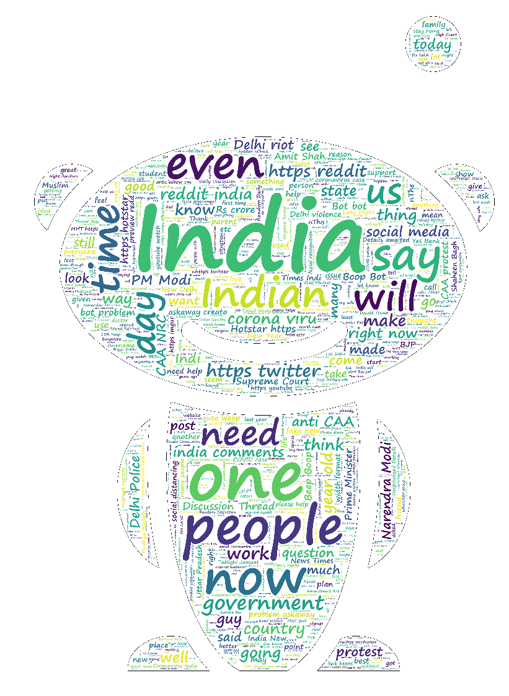

# Reddit-Flair-Detector

Check My [Website](https://redditflairdetravi.herokuapp.com/)

## Portions of Projects
Problems - Reddit Flare Detection

### Part I - Reddit Data Collection
As a starting step you have to write a script to collect data from r/india. This data would be used
in future parts of the problem to build the classifier. You have to yourself decide how to, how
much and what all data to collect.
### Part II - Exploratory Data Analysis (EDA)
Perform EDA on the data collected in Part I. This is helpful for understanding the data you have
collected. Explain in detail about the analysis you did, intuition behind doing it, output of the
analysis (in terms of graphs or tables), your inference from the output and how it shapes your
future system decisions.

### Part III - Building a Flare Detector
Posts in r/india can be corresponding to multiple topics. Each post is tagged for filtering
purposes. These tags are called a flares in the reddit world. r/india has flairs like Politics,
AskIndia, Science/Technology etc. You have to build a classifier which can predict the flare of a
reddit post. Use data collected in Part I as your training and validation data. Report detailed
analysis of performance of your classifier. We are looking for answers to questions along the
line of “How well it works?”, “What is it good at?”, “What is it bad at?”

### Part IV - Building a Web Application

Build a web application which can be used to predict Flare of a r/india post. Application should
have an input field which expects a link to a reddit post from r/india. On submission it should
predict the flare of the post.
Web applications should also have an endpoint called /automated_testing. This endpoint will
be used for testing performance of your classifier. We will send an automated POST request to
the end point with a .txt file which contains a link of a r/india post in every line. Response of the
request should be a json file in which key is the link to the post and value should be predicted
flare.

### Part V - Deployment

Deploy web applications built in Part IV on Heroku.
### Answer

* [Part I](https://github.com/ravising-h/Midas-Task-Ravi-Singh/blob/master/Part%20I%20%20-%20Reddit%20Data%20Collection.ipynb)
* [Part II](https://github.com/ravising-h/Midas-Task-Ravi-Singh/blob/master/Part%20II%20-%20%20Exploratory%20Data%20Analysis(EDA).ipynb)
* [Part III](https://github.com/ravising-h/Midas-Task-Ravi-Singh/blob/master/Part%20III%20Bert.ipynb)
* [Part IV](https://github.com/ravising-h/Midas-Task-Ravi-Singh/blob/master/app.py)
* [Part V](www.redditflairdetravi.herokuapp.com/)

### Procedure
I have extracted 1 lakhs Posts from Reddit India out of which 63332 Posts belong to 11 prominent Flair which I have Used in my project.

* 'AskIndia'
* 'CAA-NRC'
* 'Coronavirus'
* 'Food'
* 'Non-Political'
* 'Photography'
* 'Policy/Economy'
* 'Politics'
* 'Scheduled'
* 'Science/Technology'
* 'Sports'

Later I have only used maximum 2250 Post from each of them in Training.In text I have Used Title + Body + Comment in Training and Testing.
Then I have trained small ML model like Sgd Naive Bayes, SGD, Logistic regression, BERT, Distil BERT.
I have used FLASK and HTML for my Website.

#### NOTE:
##### Note: I have trained Bert which gave me an accuracy of 82% but couldn't use it due to constrains of herokuapp. So I used [SGD](https://github.com/ravising-h/Midas-Task-Ravi-Singh/blob/master/Various_model.ipynb) with 66% acc.
##### TEST CASE HAD MORE NON-POLITICAL SO THAT IT RESEMBLES TO ACTUAL DATA.
##### Actual Dataset.csv is very big (32MB) so it could not be uploaded.
